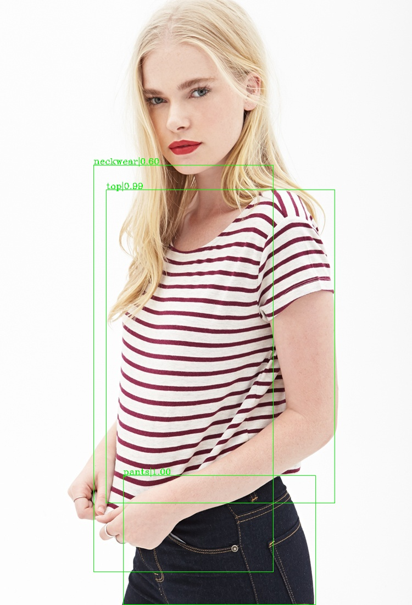
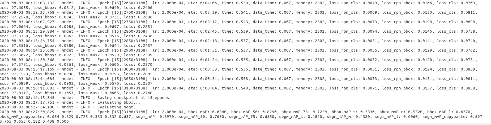
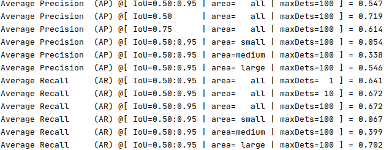

## Fashion Products Tagger

### Major features

- **Output Product Type**
    
    Product type is identified along with confidence. For eg: top | 0.98
    
- **Bounding boxes are detected**
    
    Coordinates of the products are detected and displayed.

- **Color Scheme for Products**

    Color composition for products(combined and individually) is reported in a json format 
    
    {
        
        'top' : {
            'grey' : 76.23,
            'white' : 34.36
        },
        'overall' : {
            'grey' : 33.34,
            'black' : '23',
            'white' : '44'
        }
    }
    
- **Extensions**

   training script can be used to train on more data to increase the accuracy of detections

## License

This project is released under the [Apache 2.0 license](LICENSE).

## Benchmark and model zoo

model is available at [model g-drive](https://drive.google.com/file/d/1fol3hgl2IHee2f4wOj_TfTQ5hPQfeTl0/view?usp=sharing).

## Installation

Please refer to [install.md](docs/install.md) for installation. 

## Usage
python [fashion_assignment.py](./fashion_assignment.py) --checkpoint checkpoints/fashion_product_detector --img images/04_6_flat.jpg

Pass the checkpoint path in the parameter(--checkpoint).

The trained model is available at [model g-drive](https://drive.google.com/file/d/1fol3hgl2IHee2f4wOj_TfTQ5hPQfeTl0/view?usp=sharing) 

Pass the input image path in the parameter(--img)

**Output**

Outputs an image with bounding boxes along with product type and color scheme.

## Train

The base model was provided in the original repo [openlab/mmdetection](https://github.com/open-mmlab/mmdetection).
This forked repo provides a train script to finteune the model.

To run the model simply run 

python [train.py](./train.py)

Make sure to download dataset and model  first.

This script was run for 15 epochs on a dataset of DeepFashion. (Customized for this use case)

The trained model is available at [model g-drive](https://drive.google.com/file/d/1fol3hgl2IHee2f4wOj_TfTQ5hPQfeTl0/view?usp=sharing) 

The train pipeline is illustrated here:

## Dataset Preparation

The original dataset can be found at [DeepFashion-InShop](http://mmlab.ie.cuhk.edu.hk/projects/DeepFashion/InShopRetrieval.html)  

The original dataset had 15 categories:

    01 : 'top',
    02 : 'skirt',
    03 : 'leggings',
    04 : 'dress',
    05 : 'outer',
    06 : 'pants',
    07 : 'bag',
    08 : 'neckwear',
    09 : 'headwear',
    10 : 'eyeglass',
    11 : 'belt',
    12 : 'footwear',
    13 : 'hair',
    14 : 'skin',
    15 : 'face'

This dataset was customized to have only these 12 categories:

    
    01 : 'top',
    02 : 'skirt',
    03 : 'leggings',
    04 : 'dress',
    05 : 'outer',
    06 : 'pants',
    07 : 'bag',
    08 : 'neckwear',
    09 : 'headwear',
    10 : 'eyeglass',
    11 : 'belt',
    12 : 'footwear'
``

The dataset preparation script can be run using

python [prepare_dataset.py](./prepare_dataset.py)

However you should download the original dataset first and keep it in the correct directory structure

## Metrics
mAP@0.5IOU for the test dataset was 0.719 (finetuned model)

Other metrics for different areas of object (large, small, medium) and different IOU's are 
also reported

These metrics were reported using the test.py script 

python [test.py] (./test.py) --eval bbox

Make sure to download dataset and model  first.

## Contact

This repo was forked from https://github.com/open-mmlab/mmdetection and was changed by 
Kartik Sirwani([@kartikwar]) based on his requirements

