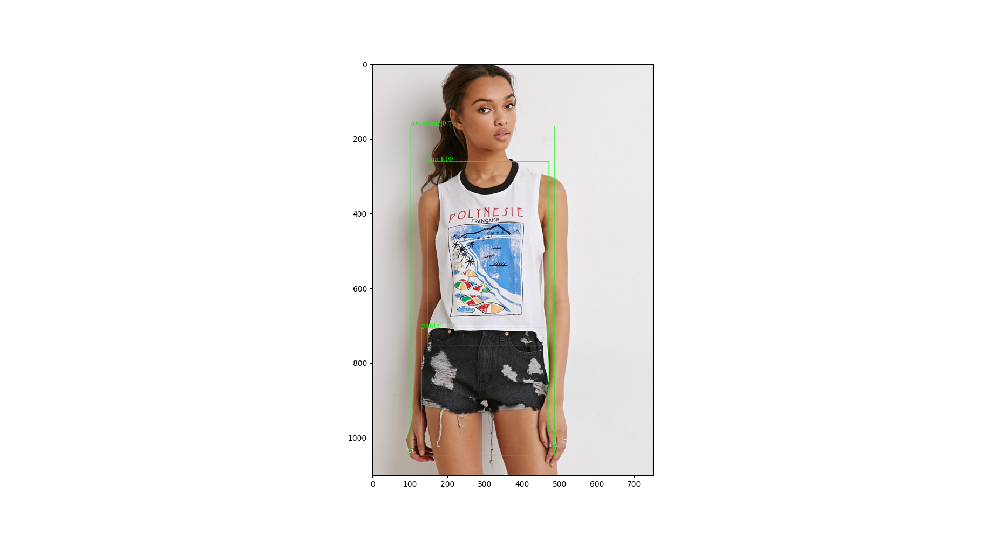

## Fashion Products Tagger

### Major features

- **Output Product Type**
    
    Product type is identified along with confidence. For eg: top | 0.98
    
- **Bounding boxes are detected**
    
    Coordinates of the products are detected and displayed.

- **Color Scheme for Products**

    Color composition for products(combined and individually) is reported in a json format 
    
    {
        
        'top' : {
            'grey' : 76.23,
            'white' : 34.36
        },
        'overall' : {
            'grey' : 33.34,
            'black' : '23',
            'white' : '44'
        }
    }
    
- **Extensions**

   training script can be used to train on more data to increase the accuracy of detections

## License

This project is released under the [Apache 2.0 license](LICENSE).

## Benchmark and model zoo

Results and models are available in the [model zoo](docs/model_zoo.md).

## Installation

Please refer to [install.md](docs/install.md) for installation and dataset preparation.

## Getting Started

Please see [getting_started.md](docs/getting_started.md) for the basic usage of MMDetection.
We provide [colab tutorial](demo/MMDet_Tutorial.ipynb) for beginners.
There are also tutorials for [finetuning models](docs/tutorials/finetune.md), [adding new dataset](docs/tutorials/new_dataset.md), [designing data pipeline](docs/tutorials/data_pipeline.md), and [adding new modules](docs/tutorials/new_modules.md).

## Contact

This repo was forked from https://github.com/open-mmlab/mmdetection and was changed by 
Kartik Sirwani([@kartikwar]) based on his requirements

